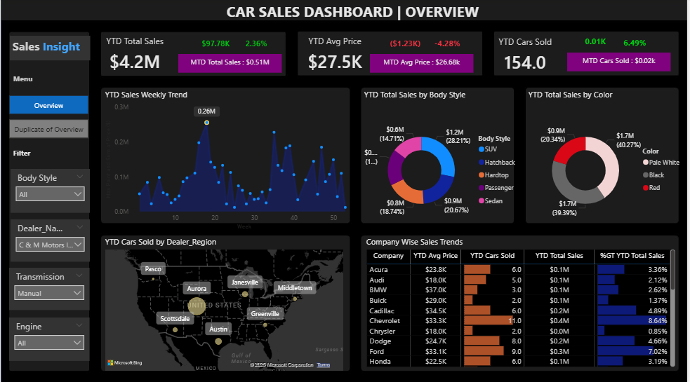

# Car Sales Dashboard 🚗📊

## 📌 Project Overview

Our company is a car dealership that sells various car models. To effectively track and analyse sales performance, we developed a **Car Sales Dashboard** in **Power BI**.

This dashboard provides real-time insights into **key performance indicators (KPIs)** and visualizes sales data across multiple dimensions such as time, body style, colour, and dealer region.

The goal is to help decision-makers **monitor sales trends, identify growth opportunities, and make data-driven business decisions**.

---

## 🎯 Objectives

* Design and develop a **dynamic and interactive dashboard** in Power BI.
* Visualize critical KPIs related to car sales.
* Provide **real-time monitoring** of sales performance.
* Support **data-driven decision-making** for the dealership.

---

## 🚨 Problem Statements

### 1. KPI’s Requirement

The dashboard tracks the following key metrics:

#### 🔹 Sales Overview

* Year-to-Date (YTD) Total Sales
* Month-to-Date (MTD) Total Sales
* Year-over-Year (YOY) Growth in Total Sales
* Difference between YTD and Previous Year-to-Date (PTYD) Sales

#### 🔹 Average Price Analysis

* YTD Average Price
* MTD Average Price
* YOY Growth in Average Price
* Difference between YTD and PTYD Average Price

#### 🔹 Cars Sold Metrics

* YTD Cars Sold
* MTD Cars Sold
* YOY Growth in Cars Sold
* Difference between YTD and PTYD Cars Sold

---

### 2. Charts Requirement

The dashboard contains the following visualizations:

1. **YTD Sales Weekly Trend** → Line chart showing weekly sales performance.
2. **YTD Total Sales by Body Style** → Pie chart of sales distribution across car body styles.
3. **YTD Total Sales by Color** → Pie chart of sales by car color.
4. **YTD Cars Sold by Dealer Region** → Map chart showing sales distribution geographically.
5. **Company-Wise Sales Trend** → Grid displaying sales trend by company.
6. **Detailed Car Sales Information** → Tabular grid showing car model, body style, colour, sales amount, dealer region, date, etc.

---

## 🛠️ Tools & Technologies

* **Power BI** – For building the dashboard
* **Excel/CSV dataset** – Source of car sales data
* **Data Modeling** – DAX functions, measures, and calculated columns

---

## 📂 Project Structure

```
Car-Sales-Dashboard/
│-- Dataset/              # Sample raw sales data (Excel/CSV)
│-- Dashboard.pbix        # Power BI dashboard file
│-- README.md             # Project documentation
```

---

## 🚀 How to Use

1. Clone this repository:

   ```bash
   git clone https://github.com/your-username/Car-Sales-Dashboard.git
   ```
2. Open `Dashboard.pbix` in **Power BI Desktop**.
3. Load the dataset provided in the `Dataset` folder.
4. Interact with the dashboard to explore insights.

---

## 📸 Dashboard Preview



---

## 📊 Key Insights

* Track **YTD, MTD, YOY** sales performance.
* Identify top-performing **car body styles and colors**.
* Understand **regional dealer performance**.
* Analyze **pricing trends** and overall profitability.

---

## 🙌 Acknowledgements

This project was created to support our dealership’s **data analytics initiative** and to showcase the power of **Power BI in business decision-making**.

---
